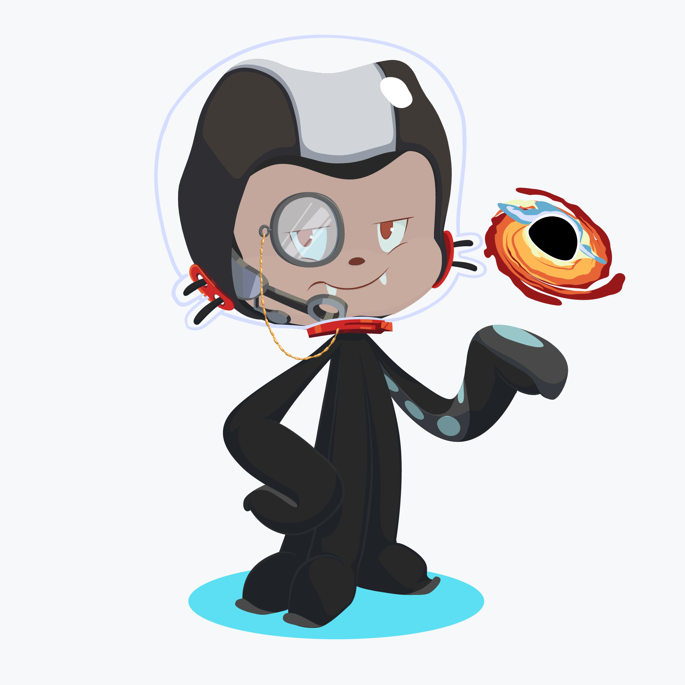

  

# :octocat: Lucas Miranda | @lucas-lm

I am a web and mobile developer. 
I love to work with React and React Native, but I also work on back-end with node and express.

  <a href="#about-me">About me</a>
  ·
  <a href="#github-stats">GitHub Stats</a>
  ·
  <a href="#skills-check">My Skillset</a>

## About me

- 🌱 I’m currently learning typescript, next.js and react native
- 💬 Ask me about **React** and **React Native**
- 📫 How to reach me: **lucas-m@outlook.com**

## GitHub stats

 
   
   

## Skills check

See what I got bellow

### I want to learn

- [ ] Adonis.js
- [ ] GraphQL
- [ ] Firebase
- [ ] Docker

### What do I actually know?

  
Langs

  <ol>
    <li>JavaScript</li>
    <li>TypeScript</li>
    <li>Python</li>
  </ol>

  
Frameworks

  <ol>
    <li>React.js</li>
    <li>Next.js</li>
    <li>React Native</li>
  </ol>

### What I know, but still have to study more

  
Services

  <ol>
    <li>AWS</li>
    <li>GCloud</li>
  </ol>

